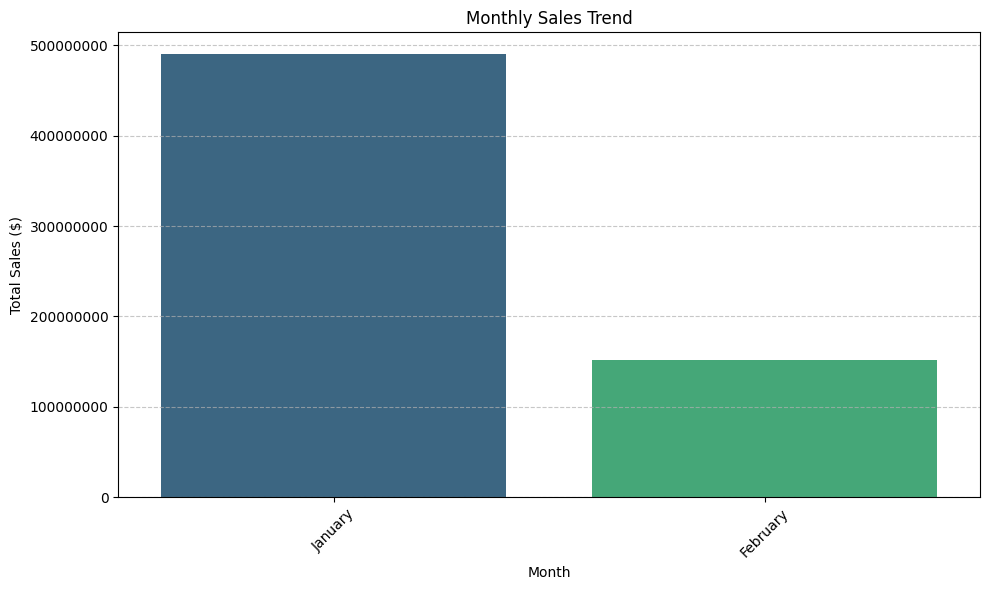
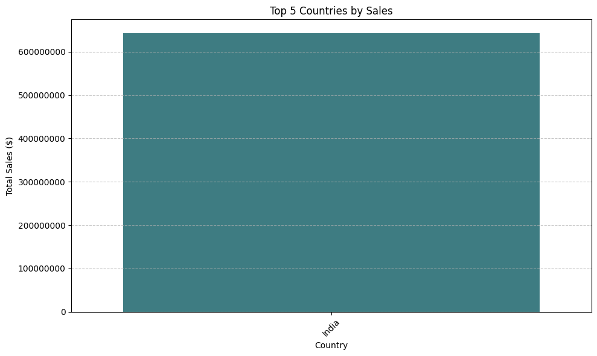
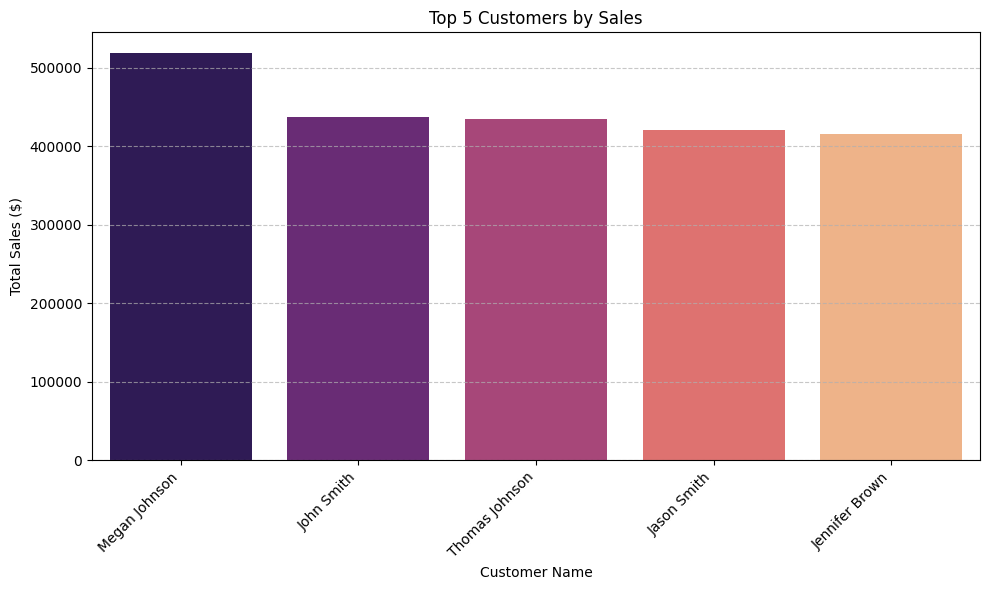
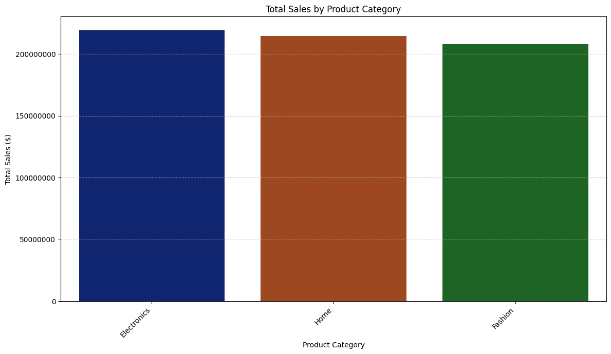
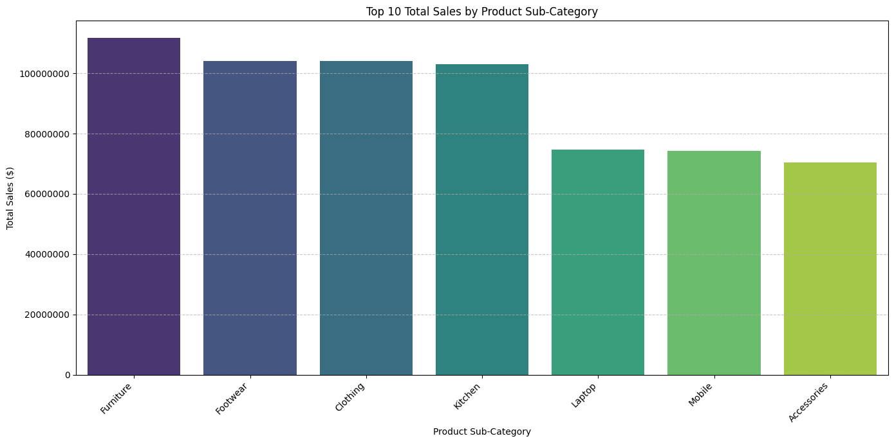
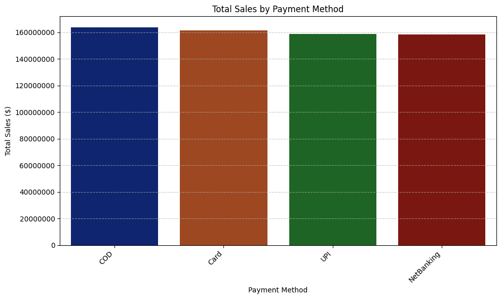
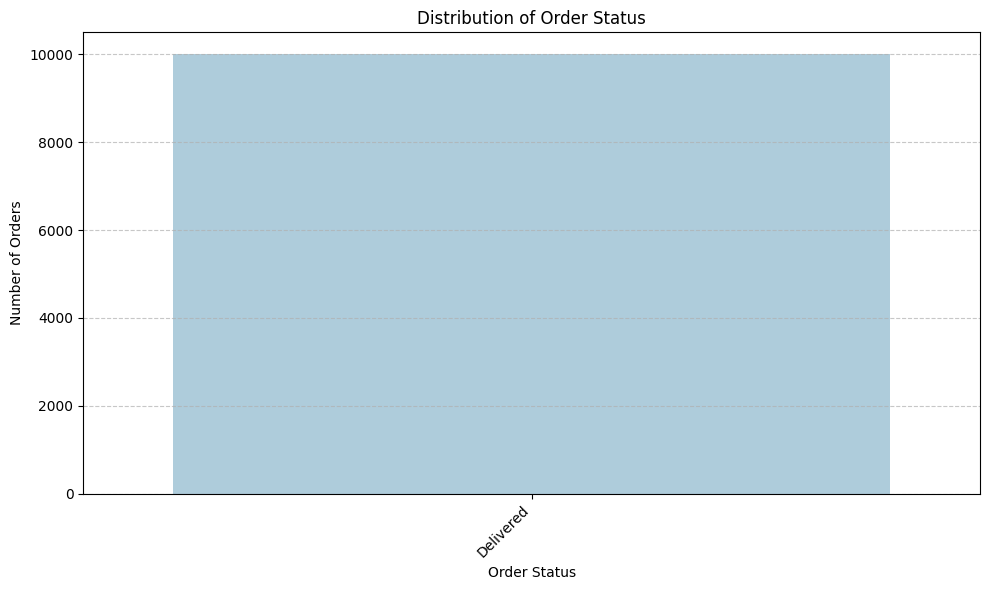

# amazon-sales-dashboard
An interactive business dashboard for Amazon sales data, providing key performance indicators, sales trends, and customer insights.
# Amazon Sales Dashboard Analysis

## Project Overview

This project presents an exploratory data analysis (EDA) and a business dashboard derived from Amazon sales data. The primary goal is to provide a clear and concise overview of sales performance, key customer insights, and essential Key Performance Indicators (KPIs) to aid stakeholders in informed decision-making.

## Table of Contents

1.  [Data Source](#data-source)
2.  [Notebook Structure](#notebook-structure)
3.  [Key Performance Indicators (KPIs) for Executives](#key-performance-indicators-kpis-for-executives)
4.  [Sales Overview & Trends](#sales-overview--trends)
5.  [Customer Insights](#customer-insights)
6.  [Order Status Analysis](#order-status-analysis)
7.  [Actionable Recommendations](#actionable-recommendations)
8.  [Visualizations](#visualizations)

## Data Source

The dataset used for this analysis is `amazon_sales_dataset.csv`, which contains various transactional details including `order_id`, `order_date`, `product_name`, `category`, `total_sales`, `payment_method`, and customer information.

## Notebook Structure

The accompanying Google Colab notebook (`amazon_sales_dashboard.ipynb`) follows a structured approach:

*   **Data Loading and Initial Overview:** Loading the dataset and examining its initial structure.
*   **Data Cleaning and Preprocessing:** Converting date columns to datetime objects and handling data types.
*   **Feature Engineering and Missing Values Check:** Extracting time-based features (year, month, day of week) and verifying data integrity.
*   **Data Analysis for Dashboard:** Calculating key sales metrics and preparing aggregated data for visualizations.
*   **Visualizations:** Generating various charts to represent sales trends, categorical performance, and customer behavior.
*   **Business Dashboard Report:** A comprehensive summary of findings and actionable recommendations (this README). 

## Key Performance Indicators (KPIs) for Executives

*   **Total Sales:** The business achieved a robust total sales figure of **$642,129,105.55**.
*   **Average Order Value:** The average order value stands at **$64,212.91**, indicating a significant value per transaction.
*   **Total Number of Orders:** A total of **10,000** distinct orders were processed within the dataset.

## Sales Overview & Trends

*   **Monthly Sales Trend:** Analysis shows a clear dominance of sales in **January** ($489.99M) over **February** ($152.14M), suggesting potential seasonality or concentrated promotional activities.
*   **Top Product Categories by Sales:** The leading categories driving sales are:
    1.  **Electronics:** $219.36M
    2.  **Home:** $214.76M
    3.  **Fashion:** $208.01M
    These three categories account for the vast majority of sales.
*   **Top 10 Product Sub-Categories by Sales:** `Furniture`, `Footwear`, `Clothing`, and `Kitchen` are strong performers, each contributing over $100M. `Laptop` and `Mobile` also exceed $74M.
*   **Geographical Sales:** **India** is the sole and dominant country in terms of sales, reflecting a concentrated market presence.
*   **Sales by Payment Method:** Sales are relatively evenly distributed across `COD`, `Card`, `UPI`, and `NetBanking`, suggesting broad appeal across various customer payment preferences.

## Customer Insights

*   **Top 5 Customers by Sales:** High-value customers include:
    1.  **Megan Johnson:** $519,128.22
    2.  **John Smith:** $437,475.71
    3.  **Thomas Johnson:** $434,161.24
    4.  **Jason Smith:** $421,137.49
    5.  **Jennifer Brown:** $415,018.88
    These customers represent a significant portion of total sales.

## Order Status Analysis

*   All **10,000 orders are marked as 'Delivered'**, indicating a high level of successful order fulfillment or a dataset focused on completed transactions.

## Actionable Recommendations

1.  **Strategic Focus on Top Categories:** Prioritize marketing, product development, and inventory for Electronics, Home, and Fashion.
2.  **Investigate Monthly Sales Disparity:** Analyze reasons for the significant sales drop from January to February to inform future planning.
3.  **Enhance Customer Retention Programs:** Implement targeted loyalty programs for top-performing customers.
4.  **Payment Method Optimization:** Ensure efficient and secure payment gateways, potentially leveraging insights for targeted promotions.
5.  **Market Expansion Consideration:** If applicable, research and plan entry into new geographical regions beyond India.
6.  **Operational Efficiency:** Maintain and optimize current fulfillment processes given the high delivery success rate.

## Visualizations

Below are some key visualizations generated during this project. Make sure you have uploaded the corresponding image files to an `images/` folder within this repository for them to display correctly.

### Monthly Sales Trend

### Top 5 Countries by Sales

### Top 5 Customers by Sales

### Total Sales by Product Category

### Top 10 Total Sales by Product Sub-Category

### Total Sales by Payment Method

### Distribution of Order Status

